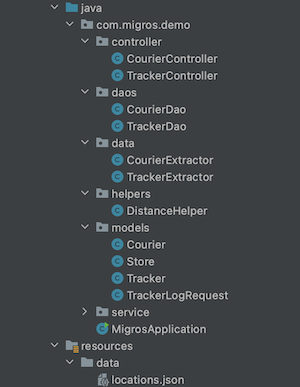

Migros Courier Tracking Interview Project
==================

In this project I used Java Spring Boot v2.5.2, MySQL database hosted online, jdbc for database operations and json simple package to extract data from provided json file. I've separated the controllers into 2; `Courier Controller` and `Tracker Controller` each of them has Autowired Singleton service classes.

I've created 3 endpoints which fills all of the requirements in the project description; 2 endpoints in Tracker Controller and 1 endpoint in Courier Controller.

Project structure:
==================

---

Models:
-------

I used 4 models. `TrackerLogRequest` is a helper model for the request body.

Store model is used for reading and converting stores.json file into List of stores.

Tracker model is used for data extraction from database.

Courier model has name and id attribute for the couriers.

Data:
-----

Extractors are implemented inside data folder to decrease line of code in daos and increase readability.

Daos:
-----

2 separate daos are used one for courier (inserting courier to db), the other is used for tracker queries and insert operations.

Helpers:
--------

Only one helper function is used which is for calculating the distance between two coordinates. I directly got the code from web and adjusted with few changes to my implementation.

---

Courier Controller:
===================

**METHOD: POST**

**`/add-courier`**

Required Body: Courier ("name": String)

Returns: Generated Courier ID (This id later will be used for querying total distances and adding tracker log for the courier)

Tracker Controller:
===================

**METHOD: POST**

**`/log-courier`**

Required Body: "courierID": Number,  "lat": Double || Float, "lng": Double || Float

Returns: Message according to conditions

I got confused a bit in the courier part because courier itself is a class containing courier id and name in my implementation so I switched to `courierID` rather than taking both name and id from the request. Also, for the time I considered to take request time as default.

**METHOD: POST**

**`/total-distance/{$courierID}`**

Required Request Parameters: "courierID": Number

Returns: Message with meters and kms for the travelled distance

---
I hope you will like my code :)

Looking forward for your feedback.

Best,

Oguz